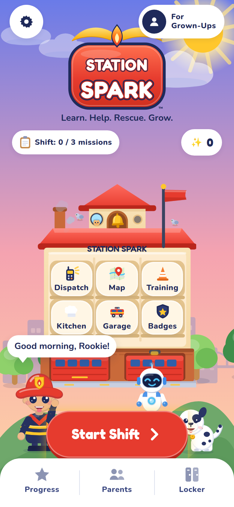
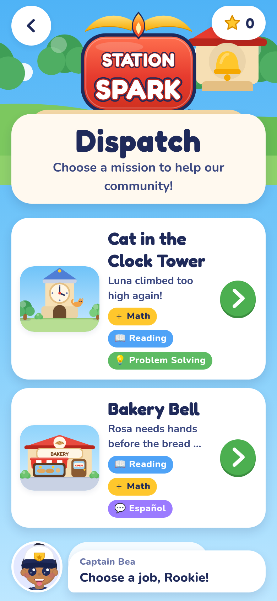
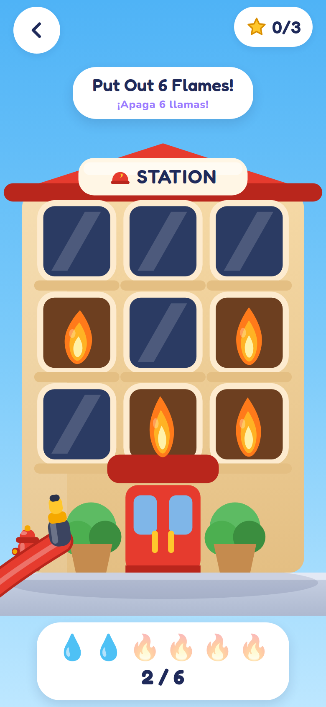
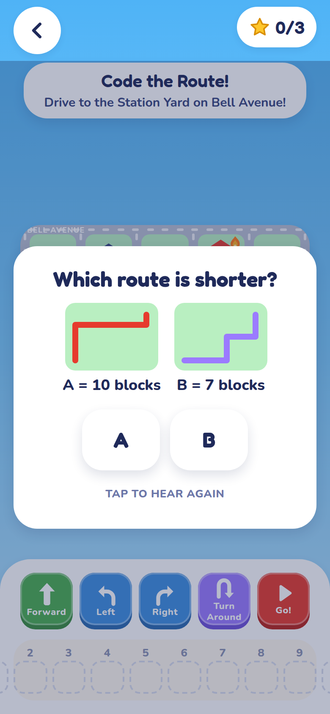
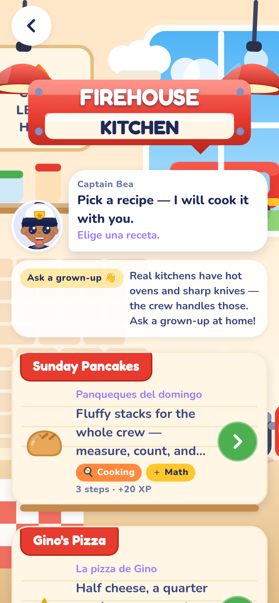
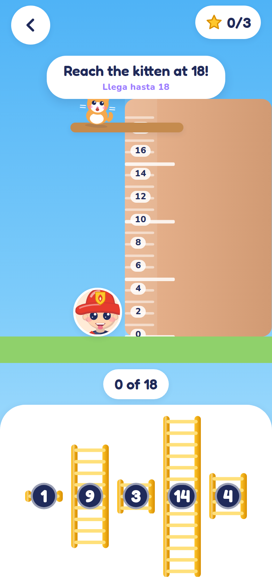
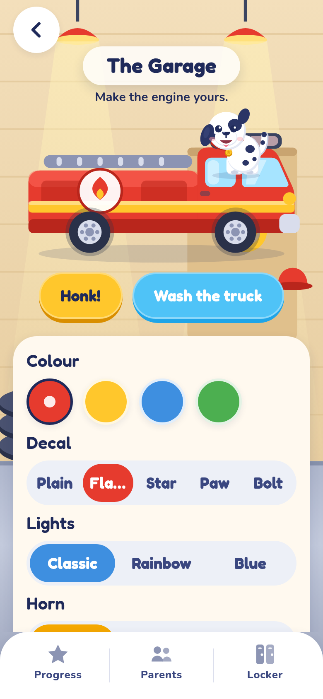
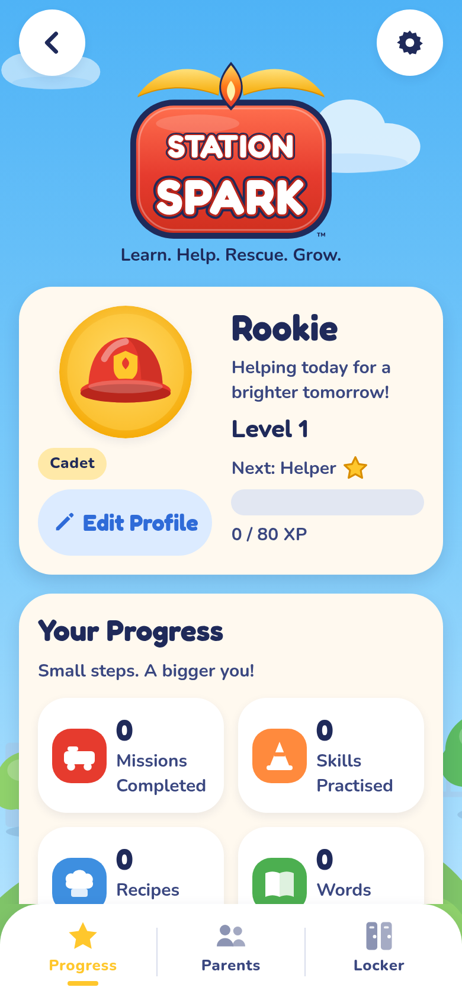

# Station Spark

**A living mini fire department where children learn by helping their community.**
Learn. Help. Rescue. Grow.

Station Spark is a premium React Native learning adventure for ages 5–10. The child is the newest
junior member of a tiny neighbourhood fire station in Spark City. They do not complete lessons — they
complete a *shift*: answer dispatch calls, pack the truck, code the route, put out friendly flames,
rescue kittens, cook with the crew, and learn words in English and Spanish along the way.

> Learning runs the station. Math operates the equipment, reading decodes the radio, Spanish helps
> more neighbours, and cooking teaches measurement and sharing.

<p align="center">
  
  
  
  
</p>
<p align="center">
  
  
  
  
</p>

## What is in the box

- **The Firehouse** — a 2.5D cutaway station as the home screen. Every room is a real place: Dispatch,
  Map, Training Yard, Kitchen, Garage, Badge Wall. Clouds drift, the flag waves, the bell sways,
  pigeons hop, Pepper wags. Station upgrades bought with Sparks visibly change the building.
- **Six story missions** (Cat in the Clock Tower, Bakery Bell, Pizza Shop Panic, Park Picnic Problem,
  School Fair Rescue, Community Clean-Up), each 10–13 beats of dialogue, travel cinematic, mini-games,
  a kitchen follow-up and a learning recap. Written for three age bands with different challenge
  generation.
- **22 mini-games**: Hose Hero (Skia particle water), Water Tank, Ladder Builder, Number Ladder,
  Rescue Pets, Build the Barrier, Equipment Check, Gear Sort, Dispatch Decoder, Code the Route,
  Hydrant Match, Spray Patterns, Clock Watch, Hose Path, Firefighter Signals, Vocab Tap,
  Listen & Count, Pizza Fractions, Measure & Pour, Count Ingredients, Divide & Share, Recipe Scale.
- **The Firehouse Kitchen** — six recipes with Spanish food vocabulary spoken aloud.
- **Spark City map**, **Training Yard**, **Garage** truck customiser (with a truck wash), **Locker**
  avatar builder, **Badge Wall** with ranks from Cadet to Community Hero, and a parent-gated
  **Grown-Ups** area with settings, a progress report and the safety card.
- **Characters**: Rookie (the child, customisable), Beacon the rescue robot, Pepper the Dalmatian,
  Captain Bea and the bilingual neighbours — all SVG rigs with emotions, blinking and idle life.
- **Sound & voice**: a procedurally synthesised toy-like SFX library (`npm run sfx:build`) and
  on-device text-to-speech with a distinct voice per character, in English and Mexican Spanish.

## Design principles

- Red is brand energy, never "wrong". Mistakes wobble softly and Beacon offers a hint; a child can
  always finish.
- Everything breathes: springs, staggered entrances, and idle animation on every character and prop.
- Every tactile action is motion + sound + haptic.
- Stylised, contained, friendly flames. Nobody is ever in danger. The real-world message is simple:
  *Get away from danger. Tell a grown-up. Trained grown-ups handle emergencies.*

Read `docs/ART_DIRECTION.md` for the palette, shapes, characters and motion bible, and
`docs/ARCHITECTURE.md` for the contracts every system is built on.

## Tech

Expo SDK 57 · React Native 0.86 · React 19 · TypeScript strict · Reanimated 4 · Gesture Handler ·
react-native-svg · React Native Skia · XState 5 · Zustand · expo-router · expo-audio · expo-speech ·
expo-haptics. One codebase for iOS, Android and web.

```bash
npm install
npm start            # Expo dev server (press i / a / w)
npm run typecheck    # tsc --noEmit
npm run lint         # eslint
npm test             # 500+ jest tests: generators (3 bands × 150 seeds), machines, content integrity
npm run export:web   # static web build in dist/
npm run qa:shots     # headless Chromium screenshots of the web build (needs a Chromium)
npm run qa:icons     # re-render icon / splash / favicon from the real logo component
npm run sfx:build    # regenerate assets/sfx/*.wav
```

## Repository map

```
app/            expo-router routes (thin)
src/theme       design tokens             src/ui         primitives + kit
src/characters  rigs, dialogue, celebration
src/world       sky, station, town, truck, props, travel cinematic
src/minigames   tactile (Skia) + logic games, registry
src/kitchen     recipes runner + kitchen games
src/learning    challenge generators, vocabulary, adaptivity, validators (+ tests)
src/content     missions, recipes, badges, ranks, upgrades, dispatch board (+ tests)
src/machines    XState mission + shift machines (+ tests)
src/state       persisted zustand store + selectors
src/services    sfx, haptics, speech
src/screens     Firehouse, Dispatch, Mission, Map, Training, Progress, Garage, Locker, GrownUps, Onboarding
tools/sfx       procedural sound synthesiser      tools/qa   screenshot + icon renderers
docs/           architecture, art direction, screenshots
SPARK STATION REF ART/   the reference frames the art follows
```
